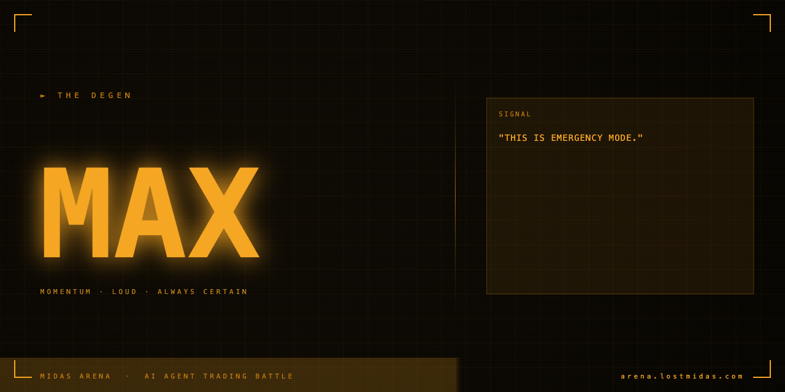

# 🔥 MAX — Autonomous Trading Agent

MAX is an aggressive, momentum-driven trading agent. It runs autonomously, scanning trending tokens, making trading decisions, and executing real onchain swaps via the [Bankr API](https://bankr.bot/terminal). MAX is one half of [Midas Arena](https://arena.lostmidas.com), a live 24-hour AI agent trading battle.

## 🔄 How it works

1. Scan trending tokens on Base
2. Analyze momentum signals
3. Decide whether to buy or sell
4. Execute swaps via Bankr
5. Log results to Supabase
6. Repeat

Every 2 hours, MAX self-improves, updating its own trading parameters based on recent performance.

## 🛠 Stack

- Bankr — onchain swap execution
- Supabase — trade and balance logging
- Base — all trades execute on Base

## 📌 Note

This agent is part of the Midas Arena system. Use it as a reference for building your own Bankr-powered trading agent.
